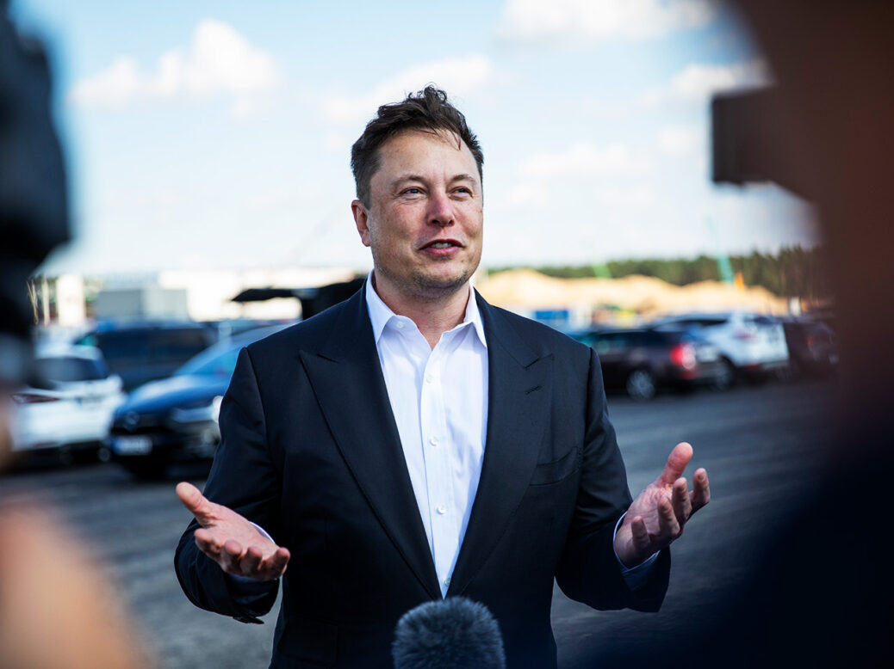
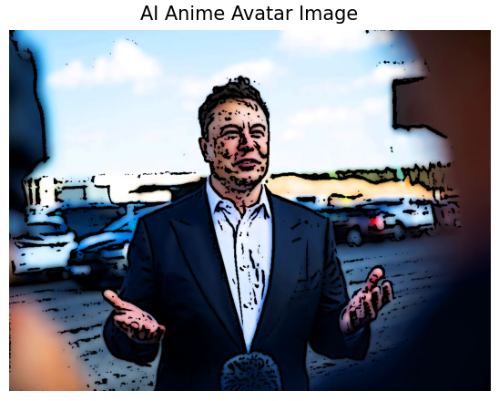

# 🎨 AI Anime Avatar Generator  

Transform your photos into **anime-style avatars** with smooth edges, vibrant colors, and soft shading transitions!  
This project uses **OpenCV** and **Matplotlib** to cartoonize real-life images, inspired by traditional anime art styles.  

---

## ✨ Features  
✅ Load any image and process it into anime-style output  
✅ Soft edges using adaptive thresholding  
✅ Smooth shading with Gaussian blur & bilateral filtering  
✅ Enhanced colors & vibrancy for an anime feel  
✅ Side-by-side comparison of original vs anime avatar  

---

## 🛠️ Tech Stack  
- **Python 3.x** – Core programming language  
- **OpenCV** – Image processing & transformations  
- **NumPy** – Numerical operations on arrays  
- **Matplotlib** – Visualization of original & processed images  

---

## 📦 Installation  

Clone the repository:  
```bash
git clone https://github.com/Sanjuu2004/AI-Anime-Avatar-Generator.git
cd AI-Anime-Avatar-Generator
```

Install dependencies:  
```bash
pip install numpy opencv-python matplotlib
```

---

## 🚀 Usage  

1. Replace the image path inside the `generate_anime_avatar()` function with your own image file.  
2. Run the script:  
   ```bash
   python anime_avatar_generator.py
   ```  
3. The **original image** and the **anime-style avatar** will be displayed side by side.  

---

## 📂 Code Overview  

- **Load Image** → Reads image in RGB format for processing  
- **Smooth Anime Effect** →  
  - Gaussian Blur → smooth shading  
  - Adaptive Thresholding → soft edges  
  - Bilateral Filtering → vibrant color enhancement  
- **Display Images** → Side-by-side comparison with Matplotlib  

---

## 🖼️ Example  

| Input Image | Output Anime Avatar |
|-------------|----------------------|
|  |  |

---

## 🌟 Possible Future Enhancements  

- 🎭 Multiple cartoon styles (Anime, Western Comics, Watercolor, etc.)  
- 🌐 Web interface with **Flask/Streamlit** for easy uploads  
- 🎨 Custom filters (background changes, overlays, artistic effects)  
- 💾 Export avatars as **PNG/SVG** for use in profiles or social media  
- 📲 Direct integration with **social media APIs** for instant sharing  

---

## ⚡ Performance Optimizations  

- Use **multithreading** for faster filtering  
- Resize large images before processing  
- Enable **GPU acceleration** with CuPy or CUDA for heavy workloads  

---

## 🐛 Troubleshooting  

- **No module named 'cv2'** → Run `pip install opencv-python`  
- **Image not displaying** → Check image path & supported formats (PNG, JPG)  
- **Slow processing** → Resize high-resolution images before applying effects  

---


